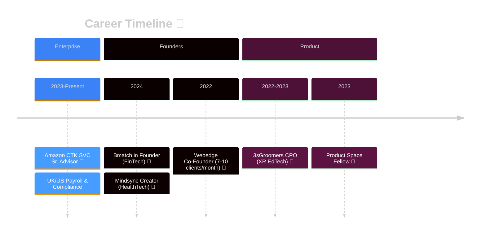

<!-- HERO SECTION WITH GRADIENTS & GLASSMORPHISM -->
<div align="center">
  
</div>

<!-- SOCIAL LINKS & VIEW COUNTER -->
<div align="center">
  
</div>

<!-- ANIMATED DIVIDER -->
<div align="center">
  
</div>

<!-- ANIMATED CONTRIBUTION SNAKE -->
<div align="center" style="margin: 30px 0;">
<picture>
  <source media="(prefers-color-scheme: dark)" srcset="https://raw.githubusercontent.com/etherealo9/etherealo9/output/github-contribution-grid-snake-dark.svg">
  <source media="(prefers-color-scheme: light)" srcset="https://raw.githubusercontent.com/etherealo9/etherealo9/output/github-contribution-grid-snake.svg">
  
</picture>
</div>

<!-- ANIMATED DIVIDER -->
<div align="center">
  
</div>

## 🎯 `$ whoami`

<div align="center">


```typescript
const etherealo9 = {
  identity: "Arghyadeep Das",
  role: ["Technical Product Manager", "Full-Stack Engineer", "XR Architect"],
  location: "Kolkata, India → Amazon (Global)",
  focus: [
    "AI-Driven Financial Due Diligence",
    "Privacy-First HealthTech", 
    "Enterprise Operational Excellence"
  ],
  philosophy: "Code is syntax. Product is why humans need it."
};
```

**`Where linguistic precision meets computational logic`**

</div>

<!-- ANIMATED DIVIDER -->
<div align="center">
  
</div>

## 💻 `$ cat /expertise/stack.json`

<div align="center">

<table>
<tr>
<td width="50%">

### 🎯 **PRODUCT & ENGINEERING**

```yaml
Architecture:
  - Next.js/React Native (SSR/Mobile)
  - Node.js/TypeScript Backend
  - Python AI/ML Pipelines
  - C++ Systems Programming

Product Management:
  - 0→1 Product Development
  - Growth Hacking (SEO/Analytics)
  - Stakeholder Alignment
  - Compliance & Operations
```

</td>
<td width="50%">

### 🚀 **AI & SPATIAL COMPUTING**

```yaml
Artificial Intelligence:
  - Context Engineering (LLM)
  - RAG Architecture
  - FinsecAGI (Financial ML)
  - Prompt Orchestration

Extended Reality:
  - Unity/Unreal Engine
  - Blender 3D Modeling
  - VR Hardware Integration
  - Spatial UI Design
```

</td>
</tr>
</table>

<br/>

<!-- ANIMATED TECH STACK BADGES -->
<p align="center">
  
</p>

<br/>

<!-- CUSTOM NEO-BRUTAL BADGES -->


</div>

<!-- ANIMATED DIVIDER -->
<div align="center">
  
</div>

## 🚀 `$ ls -la /projects`

<div align="center">

### **FEATURED REPOSITORIES**


</div>

<table>
<tr>
<td width="50%">

<div align="center">

### 🏦 **BMATCH.IN**
**`FinTech • AI-Driven Venture Capital`**

</div>

```python
problem = "Manual VC due diligence is slow"
solution = "Automated pitch deck analysis"
tech = ["Next.js", "Python", "FinsecAGI"]
impact = "10x faster investor matching"
```

**Architecture Highlights:**
- 🤖 **FinsecAGI** for financial model validation
- 🔄 **Startup-Investor** matching engine
- 📊 **Automated** compliance scoring
- 🎯 **Thesis alignment** algorithms

<div align="center">

[](https://bmatch.in)

</div>

</td>
<td width="50%">

<div align="center">

### 🧘 **MINDSYNC**
**`HealthTech • Privacy-First AI Journaling`**

</div>

```javascript
const architecture = {
  model: "BYOK (Bring Your Own Key)",
  privacy: "Zero server-side data storage",
  interface: ["Web", "CLI (@mindsync/cli)"],
  encryption: "End-to-end"
}
```

**Core Principles:**
- 🔐 **End-to-end** encryption
- 🌐 **OpenAI API** direct integration
- 💻 **Terminal-first** for power users
- 🆓 **Open-source** alternative

<div align="center">

[](https://github.com/etherealo9/MindSync)
[](https://www.npmjs.com/package/@mindsync/cli)

</div>

</td>
</tr>
<tr>
<td width="50%">

<div align="center">

### ⏱️ **CTK DURATION CALCULATOR**
**`Enterprise Ops • Amazon Internal Tool`**

</div>

```rust
fn improve_workflow() {
    identify_friction();  // Manual time calculation
    engineer_solution();  // Keyboard-first UX
    dogfood_internally(); // Amazon CTK teams
    scale_impact();       // UK/US payroll teams
}
```

**UX Innovation:**
- ⚡ **Tab autofocus** for high-volume input
- ⌨️ **Keyboard gesture** navigation
- 🎯 **Payroll compliance** optimization
- 🏢 **Enterprise-grade** reliability

<div align="center">

[](https://ctk-timecalculator.vercel.app)

</div>

</td>
<td width="50%">

<div align="center">

### 🥽 **XR SOFT-SKILLS PLATFORM**
**`EdTech • Spatial Computing`**

</div>

```cpp
// 3sGroomers - Chief Product Officer
class XRPlatform {
public:
    void integrateVRHardware();
    void buildSoftSkillSimulations();
    void scaleEdTechSaaS();
    void transformEducation();
};
```

**Leadership Scope:**
- 🎓 **VR training** curriculum design
- 🏗️ **Unity/Unreal** pipeline architecture
- ☁️ **Cloud-connected** XR infrastructure
- 🚀 **SaaS scaling** & monetization

</td>
</tr>
</table>

<!-- ANIMATED DIVIDER -->
<div align="center">
  
</div>

## 📊 `$ git log --career`

<div align="center">




</div>

<br/>

<table>
<tr>
<td width="33%">

**🏢 AMAZON**  
`Sr. Advisor • CTK Operations`

Critical payroll compliance for UK teams. Built internal tools to optimize timekeeping workflows.

**Impact:** Reduced manual processing time by 70%

</td>
<td width="33%">

**🎯 3SGROOMERS**  
`Chief Product Officer`

Led XR SaaS vision. Integrated VR hardware with cloud services for immersive soft-skill training.

**Impact:** Launched MVP with 500+ users

</td>
<td width="33%">

**🚀 ENTREPRENEUR**  
`Multiple Ventures`

Bmatch.in (VC matching), Mindsync (AI journaling), Webedge (growth agency).

**Impact:** 3 products, 2 in production

</td>
</tr>
</table>

<!-- ANIMATED DIVIDER -->
<div align="center">
  
</div>

## 📈 `$ /metrics/activity --realtime`

<div align="center">


</div>

<br/>

<table>
<tr>
<td width="50%">

<div align="center">

### 📊 **GITHUB STATS**


</div>

</td>
<td width="50%">

<div align="center">

### 🔥 **CONTRIBUTION STREAKS**


</div>

</td>
</tr>
</table>

<br/>

<table>
<tr>
<td width="50%">

<div align="center">

### 💻 **TOP LANGUAGES**


</div>

</td>
<td width="50%">

<div align="center">

### 📈 **CONTRIBUTION GRAPH**


</div>

</td>
</tr>
</table>

<br/>

<div align="center">

<!-- TROPHY SECTION -->


</div>

<!-- ANIMATED DIVIDER -->
<div align="center">
  
</div>

## 🎯 `$ echo $FOCUS_AREAS`

<div align="center">


</div>

<br/>

<table>
<tr>
<td width="33%">

<div align="center">

### 🤖 **AGENTIC AI**


</div>

Multi-agent orchestration for financial analysis

</td>
<td width="33%">

<div align="center">

### 🔍 **CONTEXT ENGINEERING**


</div>

Large-scale context window optimization (32K+ tokens)

</td>
<td width="33%">

<div align="center">

### 💰 **FINSECAGI**


</div>

Automated pitch deck evaluation & risk scoring

</td>
</tr>
<tr>
<td width="50%">

<div align="center">

### 🥽 **SPATIAL UI**


</div>

WebXR experiments for browser-based VR

</td>
<td width="50%">

<div align="center">

### 🔐 **PRIVACY TECH**


</div>

BYOK architecture patterns for sensitive data

</td>
</tr>
</table>

<!-- ANIMATED DIVIDER -->
<div align="center">
  
</div>

## 🎨 `$ cat /interests/hobbies.yaml`

<div align="center">

<table>
<tr>
<td width="25%" align="center">

### 🎵 MUSIC
🎸 Guitar  
🎹 Keyboard  
🎵 Production

</td>
<td width="25%" align="center">

### 📷 VISUAL
📸 Photography  
🎨 Design  
🎬 Videography

</td>
<td width="25%" align="center">

### ⚡ SPORTS
⚽ Football  
♟️ Chess  
🏃 Fitness

</td>
<td width="25%" align="center">

### 🌍 NATURE
🐾 Animals  
🌿 Wildlife  
🌊 Conservation

</td>
</tr>
</table>

<br/>

```yaml
Creative:
  Music: [Guitar, Keyboard, Music Production]
  Visual: [Photography]

Physical:
  Sports: [Football]

Strategic:
  Games: [Chess]

Nature:
  Passion: [Animals & Wildlife]
```

</div>

<!-- ANIMATED DIVIDER -->
<div align="center">
  
</div>

## 💭 `$ philosophy.txt`

<div align="center">


<br/>

> **English Literature taught me WHY humans communicate.**  
> **Computer Science taught me HOW machines process.**  
> **AI/ML is where these worlds collide.**
>
> I don't just write code—I architect experiences that solve real operational pain.  
> Every commit is a hypothesis. Every deploy is a validation.  
> **Product-Market Fit > Perfect Code.**

<br/>

---

<br/>

### 🎓 **EDUCATION × EVOLUTION**

<table>
<tr>
<td width="33%" align="center">

**🎓 BA ENGLISH**  
University of Calcutta  
`Language & Literature`

</td>
<td width="33%" align="center">

**💻 MCA (AI/ML)**  
MAKAUT  
`In Progress`

</td>
<td width="33%" align="center">

**🚀 FELLOWSHIP**  
Product Space  
`Product Thinking`

</td>
</tr>
</table>

<br/>

```diff
+ University of Calcutta → BA English Language & Literature
+ MAKAUT → MCA (AI/ML Specialization) [In Progress]
+ Product Space → Fellowship (Product Thinking)
```

</div>

<!-- ANIMATED DIVIDER -->
<div align="center">
  
</div>

## 📡 `$ connect --collaborate`

<div align="center">


<br/>

```bash
# Open for collaboration on:
- AI/ML product development
- Open-source HealthTech/FinTech tools  
- XR/Spatial computing experiments
- Technical writing & documentation

# Preferred contact:
$ curl -X POST https://bmatch.in/contact
$ echo "arghyadeep@bmatch.in" | mail
```

<br/>

<!-- SOCIAL PROOF -->
[](https://github.com/etherealo9)
[](https://github.com/etherealo9)

<br/><br/>

<!-- VISITOR COUNT -->
<table>
<tr>
<td align="center">

</td>
<td align="center">

</td>
</tr>
</table>

<br/><br/>

**`Built with ❤️ using Markdown, Mermaid, SVG Animations & a lot of ☕`**

</div>

---

<div align="center">


<sub>**Last updated: 2025-11-18 | Built for the future 🚀**</sub>

</div>
